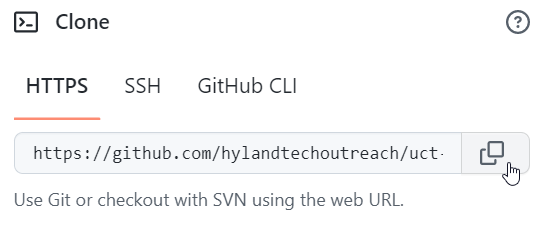
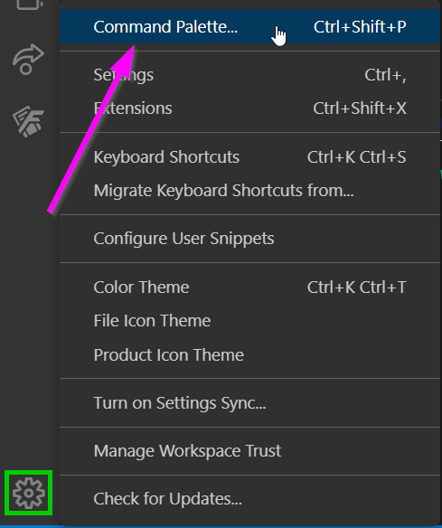
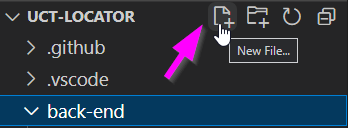
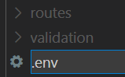
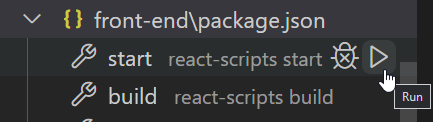

# Developer Setup Guide
Follow these steps to start contributing to the UCT Locator Project.

## Getting the Software
You will want to download and install all of these things to begin:

- [Docker Desktop](https://docs.docker.com/desktop/)
- [Visual Studio Code](https://code.visualstudio.com/Download)
- [NodeJS](https://nodejs.org/en/download/)
- Git:
  - [Download for Mac](https://git-scm.com/downloads)
  - [Download for Windows](https://gitforwindows.org/)

## Getting the Code - Cloning from GitHub
The code for the project is stored on GitHub.

### Getting the Repository URL
The first thing to do is get the URL for the repository where the code lives.

1. Open up the UCT Locator project in [GitHub](https://github.com/hylandtechoutreach/uct-locator)
1. Click the green "Code" button  
    
1. In the pop-up, make sure the "HTTPS" tab is selected
1. Click the button to copy the repository URL  
    

Now you have the URL that points to the project code!

### Cloning the Repository Locally
Next, it's time to pull down the code by cloning it with git.

1. Open Visual Studio Code
1. Click the gear icon in the lower left to open the "Manage" menu
1. Click "Command Pallette..." at the top to open the command pallette  
    
1. There, type in "Git: Clone" and press Enter
1. Next, paste in the copied repository URL, and press Enter
1. In the file explorer, select a folder (like the Desktop) for the repository location
1. On the pop-up that appears, click "Open" to open the repository folder  
    

That's it! Now you have access to all the code in the repository.

## Configuring the Application
The code from the repository is all there, but you still need to do a couple of things before the application is ready to run.

### Creating the Back-End Environment File
For the back-end of the application to work properly, it needs a database. The code is setup to search for the database URI in an environment file - **.env**.

1. In Visual Studio Code, open the File Explorer on the left  
    
1. Click on the **back-end** folder to expand it  
    
1. With the **back-end** folder selected, click the "New File..." icon  
    
1. Enter ".env" for the filename, and press Enter  
    
    
Open the new **back-end/.env** file for editing, and add these two lines:

```env
SECRET_KEY="thisissecret"
```

#### Local Database
To run the application locally you will need to have a running Postgres database. Easiest option to run this is by using docker. This command will allow you to spin up a Postgres database with the PostGIS extension already installed. 

```
docker run --name postgresql -e POSTGRES_USER=uct-user -e POSTGRES_PASSWORD=uct-password -p 5432:5432 -v pg-data:/var/lib/postgresql/data -d postgis/postgis
```

### Creating the Front-End Environment File
In addition to a back-end file, there is also a front-end **.env**. This file allows access to the Google Maps API - basically, the thing that creates and runs the interactive map in the UCT Locator app.

Follow the same basic steps as above, this time creating a new **.env** file within the ***front-end*** folder.

Open the **front-end/.env** file for editing, and add this line:

```
REACT_APP_GOOGLE_MAPS_API_KEY=<google-key-here>
```

The actual API key for Google Maps is not published here. Replace `<google-key-here>` in the **.env** file with the API key that should be provided. Optionally, create your own Google Maps API key by following [this guide](https://developers.google.com/maps/documentation/embed/get-api-key).

## Installing Application Packages
There is one thing left to do before the application is ready to run. There are a ton of packages that the application needs to use - these are big libraries of code that other people or organizations have created.

1. In Visual Studio Code, open the Terminal menu from the top
1. Select "New Terminal" to open a new terminal  
    
1. In the terminal that appears, enter `npm install` and press Enter

Once the command is done running, all the necessary packages should be installed!

## Running the Application
Now the application should be all ready to run! You will need to run both the front-end _and_ the back-end to have a fully functional local application.

1. In Visual Studio Code, open the File Explorer on the left  
    
1. At the bottom of the pane, click the "> NPM SCRIPTS" box to expand it  
    
1. Expand the **back-end\package.json** section
1. Find the **server** script and click the "Run" button to the right  
    
1. Expand the **front-end\package.json** section
1. Find the **start** script and click the "Run" button to the right  
    

Both commands should open up their own terminal windows and execute. After a minute, both the front-end and back-end should be up and running!

The front-end **start** command should automatically open up a web browser window with the application loaded. By default, the front-end should run on [localhost:3000](http://localhost:3000/), and the back-end should run on [localhost:5000](http://localhost:5000/).

The homepage should look something like this:


## Conclusion
Hopefully by following this guide, you were able to get the UCT Locator application up and running! The next step will be to start digging into the code and trying to make sense of how everything currently works. This could also be a great time to learn more about some of the technologies the application uses.
